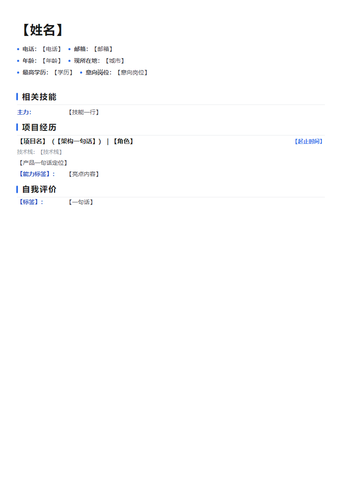

# jianli-resume-skill

**Claude Code 的中文简历生成技能**：从你当前仓库的**真实代码与提交历史**出发，自动识别项目与贡献，按目标岗位或公司 JD 定制，产出恰好一页的 `md + HTML + PDF` 三件套——每一条论断都可 grep 溯源，不编造。

> 一个命令：`/jianli 后端开发` —— 简历里写的，都是仓库里真实存在的。



## 与其他简历生成工具的区别

市面上的 AI 简历工具大多是"你粘贴经历 → AI 帮你排版润色"。本 skill 反过来：**以代码库为事实源**，先挖证据再写简历。

| | 常见 AI 简历工具 | 本 skill |
|---|---|---|
| 事实来源 | 用户手填的经历 | 自动"指纹识别"当前仓库（manifest / 目录结构 / git 提交 / 文档） |
| 防编造 | 依赖模型自觉 | **真实性红线**：每个技术名词 / 数量 / 链接必须能 grep 溯源，项目里没有就不写 |
| 单页控制 | 靠模型手感 | **三道闸**：砍弱化项 → 密度档（13/12px）→ fit 脚本等比缩放，保证恰好一页 |
| PDF 依赖 | XeLaTeX / 在线服务 | **零依赖**：Windows 自带 Edge 无头打印，开箱即用 |
| 团队项目 | 容易把团队的写成自己的 | `git shortlog` 确认作者边界，只写本人工作 |
| 中文求职场景 | 英文 ATS 导向 | 中文简历 + BOSS 直聘短文案 + JD 逐条响应清单 |

## 功能

- **岗位模式**：`/jianli <岗位>` —— 内置 **20 类岗位画像矩阵**（后端 / 前端 / 全栈 / AI 应用 / 算法 / 数据开发 / 数据分析 / 客户端 / 小程序跨端 / 嵌入式 IoT / 网络安全 / 游戏开发 / 产品经理 / DBA / 运维 DevOps / 测试开发 / RPA / 技术支持 / 视频剪辑…），按画像决定卖点排序、证据挖掘方向、弱化项与关键词分布；不在矩阵内的岗位走**通用兜底**——按岗位关键词现场找证据，任意岗位都能生成
- **多模板版式**：经典 / 双栏 / 极简 / 现代**四套内置模板**，调用时带版式关键词即切换（如 `/jianli 后端开发 双栏`）；四套共享同一单页自适应契约，换模板不影响"恰好一页"
- **JD 模式**：`/jianli <公司JD>` —— 粘贴 JD 文本或文件路径，逐条解析硬性要求 → 在项目里找证据；有证据的放大，没证据的**明确标注"未覆盖"**，绝不硬凑
- **多公司批量**：给几家公司 JD 就出几份定制简历，共用同一批项目证据、措辞各自不同
- **审查模式**：`/jianli 审查 [文件]` —— 只诊断不重写：版式（单页 / 字号 / 留白）· 真实性（逐条溯源）· 表达（被动词 / 空话 / 缺量化），出问题清单，确认后再改
- **事实资料库**：`简历-资料库.md` 存个人信息与已溯源事实，生成前读取免重复盘问、生成后回写新确认的信息
- **覆盖前备份**：重打 / 重生成时旧文件整套备份到 `简历备份/`，改坏可回退
- **伴生产物（可选）**：BOSS 直聘表单短文案（~200 字）+ 分点长版（~400 字）、按简历亮点生成的模拟面试题

## 安装

**用户级（推荐，任意项目可用）**

```powershell
# Windows / macOS / Linux 通用：克隆到用户级技能目录
git clone https://github.com/<you>/jianli-resume-skill.git ~/.claude/skills/jianli
```

Windows PowerShell 下 `~` 即 `C:\Users\<你>`；也可以只想要项目级安装时，克隆到 `<项目>/.claude/skills/jianli/`。

安装后重启 Claude Code，任意会话输入 `/jianli` 即可。

## 用法

```
/jianli 后端开发                  # 岗位模式，走岗位矩阵
/jianli AI应用开发                # 同上，AI 方向画像
/jianli 后端开发 双栏             # 指定双栏版式（经典/双栏/极简/现代）
/jianli <粘贴JD全文或文件路径>     # JD 模式，按这家公司定制
/jianli 审查 简历-后端开发.md      # 审查模式，只出问题清单
```

四套模板预览：[经典](docs/demo.png) · [双栏](docs/template-sidebar.png) · [极简](docs/template-minimal.png) · [现代](docs/template-accent.png)

产出（写入当前项目根目录）：

```
简历-<岗位>.md            # Markdown 源稿
resume-<岗位>.html        # 带版式的 HTML（可直接浏览器打开微调）
简历-<岗位>.pdf           # 恰好一页的 PDF（自动打开预览）
简历-<岗位>.png           # 排版校验用截图
```

## 工作流程

1. **确认输入** — 岗位 / JD / 个人信息（未提供的用【占位】，绝不编造）
2. **解析 JD** — 硬性要求逐条建响应清单，映射项目证据
3. **识别项目** — 技术栈 / 领域 / 规模 / 部署，全部来自仓库实际检测
4. **提取贡献** — `git log` / `git shortlog` 还原你本人做的工作，团队项目先确认工作边界
5. **定向** — 岗位矩阵或 JD 定制：核心卖点放最前、弱化项压掉、关键词自然分布
6. **撰写输出** — md → HTML → PDF 三件套，单页三道闸保证不超一页
7. **自校验** — 逐条 grep 溯源 + PNG 检查排版，超页 / 过密 / 编造一律打回重出

## 平台说明

- **PDF 生成**：`references/pdf_build.ps1` 使用 Edge / Chrome 无头打印，默认查找 Windows 安装路径。macOS / Linux 用户可将脚本中的浏览器路径换成系统 Chrome（如 `/usr/bin/google-chrome`），参数完全一致（`--headless --print-to-pdf`）
- **版式模板**：`references/resume-template.html` 自带单页自适应 fit 脚本（CSS zoom 等比缩放 + 底部留白常量），复用自己项目模板时把这段脚本注入 `</body>` 前即可获得同样的单页保证

## 真实性声明

本 skill 的设计目标是"可溯源的简历"而非"好看的简历"：

- 每个技术名词、数量、链接都必须能在当前项目溯源（grep / 文档 / git 复核）
- 项目里没有的技术（"高并发""千万级""分布式事务"…）绝不出现
- 量化数据拿不准就写范围，不编精确数
- 交付时提醒用户逐条核对——**面试时简历里每一点都要能讲清楚**

## License

[MIT](LICENSE)
